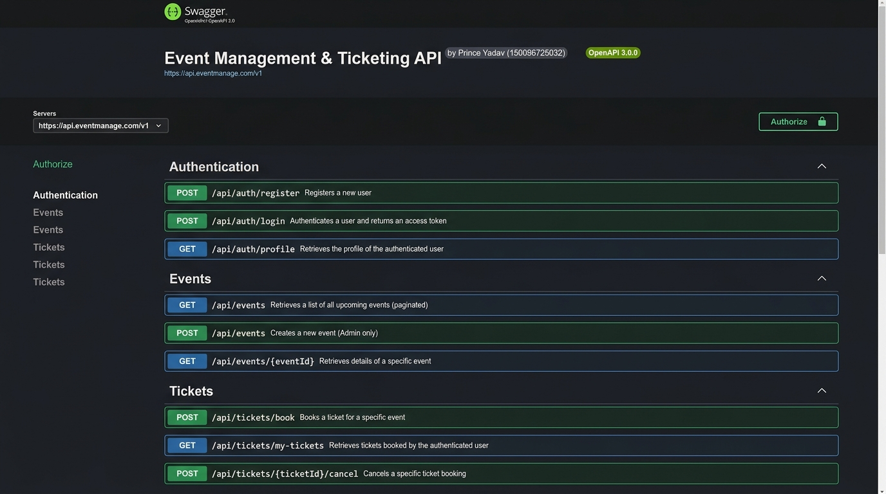
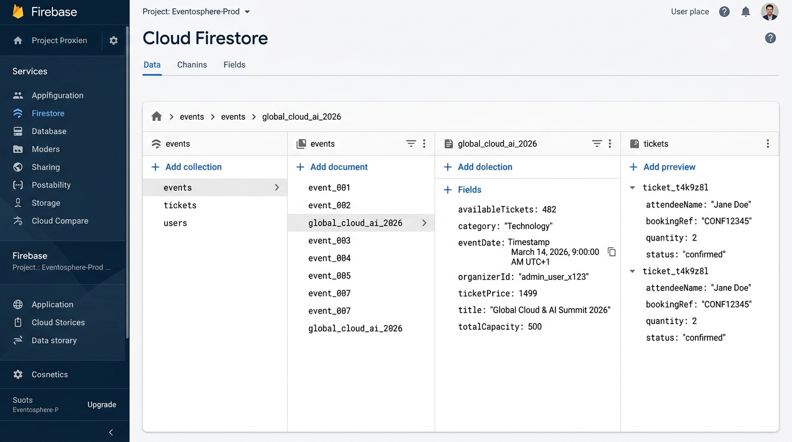

# 🎟️ Event Management & Ticketing API with Firebase & Swagger

> **Student Name:** Pratik Swain  
> **Roll No:** `150096725184`  
> **Live Render Deployment:** [https://assignment-12-event-management-ticketing-4fpm.onrender.com](https://assignment-12-event-management-ticketing-4fpm.onrender.com/)  
> **Interactive Swagger Documentation:** [https://assignment-12-event-management-ticketing-4fpm.onrender.com/api-docs](https://assignment-12-event-management-ticketing-4fpm.onrender.com/api-docs)  
> **Repository:** [https://github.com/pratikswain070-blip/assignment-12-event-management-ticketing-api](https://github.com/pratikswain070-blip/assignment-12-event-management-ticketing-api)  
> **Tech Stack:** Node.js, Express.js, Firebase Firestore & Auth, express-rate-limit, swagger-ui-express, swagger-jsdoc, dotenv, cors, bcryptjs, jsonwebtoken  

---

## 📌 Overview

A high-concurrency **Event Ticketing & Live Booking REST API** engineered with **Google Firebase Firestore**, secured with **JWT Role-Based Access Control (RBAC)** (`Organizer` vs `Attendee`), hardened with **API Rate Limiting** to prevent ticket-scalping bots, and documented comprehensively with **Swagger OpenAPI 3.0**.

The system utilizes **Firestore ACID transactions (`runTransaction`)** to ensure ticket inventory decrements atomically under concurrent traffic, guaranteeing tickets are never oversold.

### 🌟 Key Capabilities
- **Firestore ACID Transactions:** Atomic ticket decrements and inventory restorations via `db.runTransaction` guaranteeing zero overselling under race conditions.
- **Bot & Scalper Protection:** Strict `express-rate-limit` policy (10 requests / min limit per IP) on `/api/tickets/book` returning HTTP `429 Too Many Requests`.
- **Role-Based Access Control (RBAC):** Middleware pipelines strictly isolating Organizer capabilities (create, update, delete events, view attendees) from Attendee capabilities (book tickets, view my tickets, cancel bookings).
- **Interactive Swagger Documentation:** Complete OpenAPI 3.0 documentation available at `/api-docs` with JWT Bearer authorization support.
- **Date & Location Query Filters:** Browse upcoming events filtered by category (e.g., `Technology`) and city/venue (e.g., `Mumbai`).

---

## 📸 Documentation & Database Screenshots

### 1. Interactive Swagger UI (`/api-docs`)


### 2. Firebase Firestore Database Collections


---

## 🗄️ Firestore Database Schema

### 1. `events` Collection
```json
{
  "id": "event_techconf_2026",
  "title": "Global Cloud & AI Summit 2026",
  "description": "Annual flagship backend conference",
  "category": "Technology",
  "eventDate": "2026-06-15T09:00:00Z",
  "venue": "Bandra Kurla Complex, Mumbai",
  "organizerId": "usr_organizer_01",
  "ticketPrice": 1499,
  "totalCapacity": 500,
  "availableTickets": 482,
  "createdAt": "2026-03-01T12:00:00Z"
}
```

### 2. `tickets` Collection
```json
{
  "id": "ticket_rec_88219",
  "eventId": "event_techconf_2026",
  "eventTitle": "Global Cloud & AI Summit 2026",
  "userId": "usr_attendee_99",
  "attendeeName": "Kunal Sharma",
  "attendeeEmail": "kunal@gmail.com",
  "quantity": 2,
  "totalPaid": 2998,
  "bookingRef": "TKT-2026-88219",
  "status": "confirmed",
  "bookedAt": "2026-03-02T16:20:00Z",
  "cancelledAt": null
}
```

### 3. `users` Collection
```json
{
  "id": "usr_organizer_01",
  "name": "Pratik Swain",
  "email": "pratik@example.com",
  "role": "Organizer",
  "password": "$2a$10$hashedPasswordString...",
  "createdAt": "2026-03-01T10:00:00Z"
}
```

---

## 📋 API Endpoints Specification

### 🔐 Authentication

| Method | Endpoint | Role Access | Description |
|---|---|:---:|---|
| `POST` | `/api/auth/register` | Public | Register as `Attendee` or `Organizer` (hashes password with bcrypt) |
| `POST` | `/api/auth/login` | Public | Authenticate credentials and obtain JWT Bearer token (7-day validity) |
| `GET` | `/api/auth/profile` | Authenticated | Retrieve authenticated user profile & role |

### 🎪 Event Management Endpoints

| Method | Endpoint | Role Access | Description |
|---|---|:---:|---|
| `GET` | `/api/events` | Public | Browse upcoming events (supports `?category=Technology&city=Mumbai`) |
| `GET` | `/api/events/:id` | Public | View event details & live remaining ticket count |
| `POST` | `/api/events` | **Organizer** | Create new event listing (`availableTickets` initialized to `totalCapacity`) |
| `PUT` | `/api/events/:id` | **Organizer** | Update event details (Organizer must own event) |
| `DELETE` | `/api/events/:id` | **Organizer** | Cancel and delete event (Organizer must own event) |
| `GET` | `/api/events/:id/attendees` | **Organizer** | List all registered attendees for the event |

### 🎟️ Ticket Booking & Scalper Protection (Rate Limited)

| Method | Endpoint | Role Access | Description |
|---|---|:---:|---|
| `POST` | `/api/tickets/book` | **Attendee** | **Atomic Booking**: 10 requests / min limit. Decrements tickets via transaction |
| `GET` | `/api/tickets/my-tickets` | **Attendee** | View purchased tickets for authenticated attendee |
| `POST` | `/api/tickets/:id/cancel` | **Attendee** | Cancel ticket & restore ticket inventory to event via transaction |

### 📚 Interactive Swagger Documentation

| Method | Endpoint | Description |
|---|---|---|
| `GET` | `/api-docs` | Interactive Swagger UI documentation with OpenAPI 3.0 specs and Bearer Auth |
| `GET` | `/` | API status and root landing with link to `/api-docs` |
| `GET` | `/health` | Server uptime health check |

---

## ⚡ Concurrency & ACID Transaction Logic

The ticket booking endpoint executes within Firestore's atomic transaction context (`db.runTransaction`):

```javascript
// controllers/ticketController.js
const result = await db.runTransaction(async (t) => {
  const eventDoc = await t.get(eventRef);
  if (!eventDoc.exists) {
    throw new Error('Event not found');
  }

  const eventData = eventDoc.data();
  if (eventData.availableTickets < qty) {
    throw new Error(`Insufficient tickets available. Only ${eventData.availableTickets} tickets left.`);
  }

  // 1. Atomically decrement available tickets
  t.update(eventRef, {
    availableTickets: eventData.availableTickets - qty
  });

  // 2. Atomically create ticket document
  const bookingRef = `TKT-${Date.now().toString().slice(-6)}`;
  const newTicket = {
    id: ticketRef.id,
    eventId,
    eventTitle: eventData.title,
    userId,
    attendeeName,
    attendeeEmail,
    quantity: qty,
    totalPaid: qty * eventData.ticketPrice,
    bookingRef,
    status: 'confirmed',
    bookedAt: new Date().toISOString()
  };

  t.set(ticketRef, newTicket);
  return newTicket;
});
```

---

## 🏗️ Project Architecture

```text
assignment-12-event-management-ticketing-api/
├── pratik swain 150096725184/
│   ├── config/
│   │   ├── firebaseConfig.js    # Firebase Admin Firestore init (supports serviceAccountKey & env vars)
│   │   └── swagger.js           # Swagger specification config
│   ├── controllers/
│   │   ├── authController.js    # Authentication & Profile logic
│   │   ├── eventController.js   # Event CRUD, filters & attendee listing
│   │   └── ticketController.js  # Atomic booking & cancellation transactions
│   ├── docs/
│   │   ├── swagger-ui.png       # Interactive Swagger UI screenshot
│   │   └── firestore-collections.png # Firestore collections screenshot
│   ├── middleware/
│   │   ├── auth.js              # JWT verification
│   │   ├── checkRole.js         # Organizer vs Attendee guard
│   │   └── rateLimiter.js       # Strict booking rate limit (10 req/min)
│   ├── routes/
│   │   ├── authRoutes.js        # Auth route definitions with Swagger JSDoc
│   │   ├── eventRoutes.js       # Event route definitions with Swagger JSDoc
│   │   └── ticketRoutes.js      # Ticket route definitions with Swagger JSDoc
│   ├── test/
│   │   └── api-test.js          # Automated test suite (25 test cases)
│   ├── .env.example             # Environment variables template
│   ├── package.json             # Subfolder package dependencies
│   ├── server.js                # Express app entry point
│   └── README.md                # Subfolder documentation
├── .gitignore                   # Ignores credentials, .env, and node_modules
├── package.json                 # Root package delegator for Render
└── README.md                    # Main Project Documentation
```

---

## 🔐 Environment Variables for Render Deployment

When deploying to **Render** ([https://dashboard.render.com/](https://dashboard.render.com/)):
1. Create a New **Web Service** and select `assignment-12-event-management-ticketing-api`.
2. **Build Command:** `npm install`
3. **Start Command:** `npm start`
4. Under **Environment Variables**, add:

| Key | Example Value | Description |
|---|---|---|
| `PORT` | `10000` | Render standard application port |
| `NODE_ENV` | `production` | Production environment mode |
| `JWT_SECRET` | `supersecret_jwt_key_event_management_2026_pratik` | Secret key for signing JWT tokens |
| `JWT_EXPIRES_IN` | `7d` | Expiration window for JWT tokens |
| `FIREBASE_SERVICE_ACCOUNT` | `{"type":"service_account","project_id":"...","private_key":"...","client_email":"..."}` | Service account JSON string |

---

## 🚀 Setup & Execution

### 1. Install Dependencies
```bash
cd "pratik swain 150096725184"
npm install
```

### 2. Run the Application
```bash
# Production start
npm start

# Development mode (with nodemon)
npm run dev
```

The server will start on `http://localhost:5001`. Access interactive Swagger documentation at `http://localhost:5001/api-docs`.

### 3. Run Automated Tests
```bash
npm test
```

The test suite executes 25 automated assertions:
1. Root health check & Swagger UI availability
2. Organizer and Attendee registration, login & profile retrieval
3. Role-Based Access Control (RBAC) rejection of Attendee creating events
4. Event creation with capacity 5 and category/city query filtering
5. Concurrency stress test: 6 simultaneous booking requests for 5 tickets, asserting exactly 5 succeed, 1 fails with oversell rejection, and `availableTickets` reaches 0
6. Ticket cancellation and automatic inventory restoral back to 1
7. Organizer retrieval of attendee booking lists
8. Scalper bot protection: 12 rapid booking requests triggering HTTP `429 Too Many Requests`
